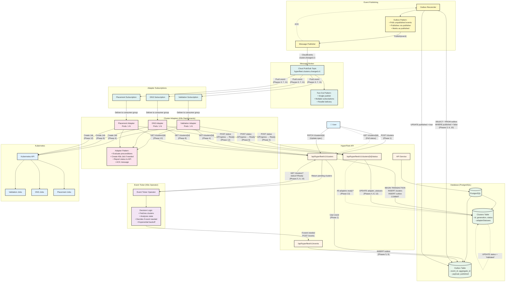

### Hyperfleet Components

#### Components Relationship Diagram

```mermaid
graph TB
    User[👤 User]

    subgraph "HyperFleet API"
        API[API Service]
        ClusterEndpoint["/api/hyperfleet/v1/clusters"]
        EventEndpoint["/api/hyperfleet/v1/events"]
        StatusEndpoint["/api/hyperfleet/v1/clusters/{id}/status"]
    end

    subgraph "Database (PostgreSQL)"
        DB[(PostgreSQL)]
        ClustersTable[("Clusters Table<br/>- id, generation, status<br/>- adapterStatuses")]
        OutboxTable[("Outbox Table<br/>- event_id, aggregate_id<br/>- payload, published")]
    end

    subgraph "Event Ticker (K8s Operator)"
        Ticker[Event Ticker Operator]
        TickerLogic["Decision Logic:<br/>• Fetches clusters<br/>• Analyzes state<br/>• Decides if event needed<br/>• Exponential backoff"]
    end

    subgraph "Event Publishing"
        Outbox[Outbox Reconciler]
        Publisher[Message Publisher]
        OutboxLogic["Outbox Pattern:<br/>• Polls unpublished events<br/>• Publishes via publisher<br/>• Marks as published"]
    end

    subgraph "Message Broker"
        Broker[Cloud Pub/Sub Topic<br/>hyperfleet.clusters.changed.v1]
        BrokerLogic["Fan-Out Pattern:<br/>• Single publish<br/>• Multiple subscriptions<br/>• Parallel delivery"]
    end

    subgraph "Adapter Subscriptions"
        ValSub[Validation Subscription]
        DnsSub[DNS Subscription]
        PlaceSub[Placement Subscription]
    end

    subgraph "Cluster Adapters (K8s Deployments)"
        ValAdapter[Validation Adapter<br/>Pods: 1-N]
        DnsAdapter[DNS Adapter<br/>Pods: 1-N]
        PlaceAdapter[Placement Adapter<br/>Pods: 1-N]

        AdapterLogic["Adapter Pattern:<br/>• Evaluate preconditions<br/>• Create K8s Job if needed<br/>• Report status to API<br/>• ACK message"]
    end

    subgraph "Kubernetes"
        K8s[Kubernetes API]
        ValJob[Validation Jobs]
        DnsJob[DNS Jobs]
        PlaceJob[Placement Jobs]
    end

    %% User flows
    User -->|"POST /clusters<br/>(Phase 1)"| ClusterEndpoint
    User -.->|"GET /clusters/{id}<br/>(Poll status)"| ClusterEndpoint
    User -->|"PATCH /clusters/{id}<br/>(Update spec)"| ClusterEndpoint

    %% API to Database
    API --> DB
    DB --> ClustersTable
    DB --> OutboxTable

    ClusterEndpoint -->|"BEGIN TRANSACTION<br/>INSERT clusters<br/>INSERT outbox<br/>COMMIT"| ClustersTable
    ClusterEndpoint -->|"User event<br/>(Phase 1)"| OutboxTable

    EventEndpoint -->|"INSERT outbox<br/>(Phases 5, 9)"| OutboxTable

    StatusEndpoint -->|"UPDATE adapter_statuses<br/>(Phases 4, 8, 12)"| ClustersTable

    %% Ticker flows
    Ticker -->|"GET /clusters?status!=Ready<br/>(Phases 5, 9, 14)"| ClusterEndpoint
    ClusterEndpoint -->|"Return pending clusters"| Ticker
    Ticker --> TickerLogic
    TickerLogic -->|"If event needed<br/>POST /events"| EventEndpoint

    %% Outbox reconciler flows
    Outbox -->|"SELECT * FROM outbox<br/>WHERE published = false<br/>(Phases 2, 6, 10)"| OutboxTable
    Outbox --> OutboxLogic
    OutboxLogic -->|"Publish(event)"| Publisher
    Publisher -->|"CloudEvents<br/>cluster.changed.v1"| Broker
    Broker --> BrokerLogic
    Publisher -.->|"ACK"| Outbox
    Outbox -->|"UPDATE published = true"| OutboxTable

    %% Fan-out to adapters
    Broker -->|"Push event<br/>(Phases 3, 7, 11)"| ValSub
    Broker -->|"Push event<br/>(Phases 3, 7, 11)"| DnsSub
    Broker -->|"Push event<br/>(Phases 3, 7, 11)"| PlaceSub

    ValSub -->|"Deliver to consumer group"| ValAdapter
    DnsSub -->|"Deliver to consumer group"| DnsAdapter
    PlaceSub -->|"Deliver to consumer group"| PlaceAdapter

    %% Adapters fetch cluster and evaluate
    ValAdapter -->|"GET /clusters/{id}<br/>(Phase 4)"| ClusterEndpoint
    DnsAdapter -->|"GET /clusters/{id}<br/>(Phase 8)"| ClusterEndpoint
    PlaceAdapter -->|"GET /clusters/{id}<br/>(Phase 12)"| ClusterEndpoint

    ValAdapter --> AdapterLogic
    DnsAdapter --> AdapterLogic
    PlaceAdapter --> AdapterLogic

    %% Adapters create jobs
    ValAdapter -->|"Create Job<br/>(Phase 4)"| K8s
    DnsAdapter -->|"Create Job<br/>(Phase 8)"| K8s
    PlaceAdapter -->|"Create Job<br/>(Phase 12)"| K8s

    K8s --> ValJob
    K8s --> DnsJob
    K8s --> PlaceJob

    %% Adapters report status
    ValAdapter -->|"POST status<br/>InProgress → Ready<br/>(Phase 4)"| StatusEndpoint
    DnsAdapter -->|"POST status<br/>InProgress → Ready<br/>(Phase 8)"| StatusEndpoint
    PlaceAdapter -->|"POST status<br/>InProgress → Ready<br/>(Phase 12)"| StatusEndpoint

    %% Status updates trigger cluster status change
    StatusEndpoint -.->|"All adapters ready?<br/>(Phase 13)"| ClustersTable
    ClustersTable -.->|"UPDATE status = 'Validated'"| ClustersTable

    %% Styling
    classDef userClass fill:#e1f5ff,stroke:#333,stroke-width:2px
    classDef apiClass fill:#fff4e6,stroke:#333,stroke-width:2px
    classDef dbClass fill:#e8f5e9,stroke:#333,stroke-width:2px
    classDef tickerClass fill:#f3e5f5,stroke:#333,stroke-width:2px
    classDef outboxClass fill:#fff9c4,stroke:#333,stroke-width:2px
    classDef brokerClass fill:#e0f2f1,stroke:#333,stroke-width:2px
    classDef adapterClass fill:#fce4ec,stroke:#333,stroke-width:2px
    classDef k8sClass fill:#e3f2fd,stroke:#333,stroke-width:2px
    classDef logicClass fill:#f5f5f5,stroke:#666,stroke-width:1px,stroke-dasharray: 5 5

    class User userClass
    class API,ClusterEndpoint,EventEndpoint,StatusEndpoint apiClass
    class DB,ClustersTable,OutboxTable dbClass
    class Ticker,TickerLogic tickerClass
    class Outbox,Publisher,OutboxLogic outboxClass
    class Broker,BrokerLogic,ValSub,DnsSub,PlaceSub brokerClass
    class ValAdapter,DnsAdapter,PlaceAdapter,AdapterLogic adapterClass
    class K8s,ValJob,DnsJob,PlaceJob k8sClass
```