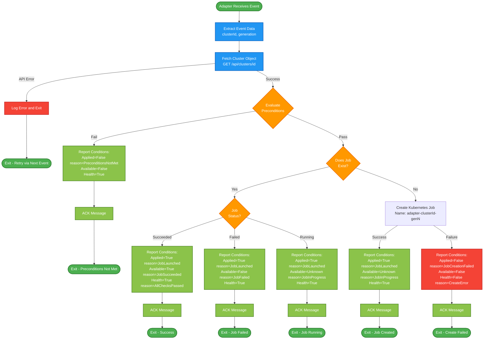

### Adapter Event Processing Flow

Purpose: This diagram shows the complete flow for how a HyperFleet adapter processes an event, from receiving the message through final status reporting.

Pattern: Event-driven, precondition-based job orchestration



### Key Patterns

#### Stateless Reconciliation
**Purpose**: Each event is a snapshot check, not a long-running process

**Pattern**:
```
1. Receive event
2. Fetch cluster
3. Evaluate preconditions
4. Check job exists
   - Yes → Report current job status
   - No → Create job and report
5. ACK message
6. Exit

Next event (from ticker):
7. Receive event again
8. Check job status again
9. Report updated status
```

**Benefits**:
- Simple, predictable code
- Fast event processing (~100ms)
- No resource leaks (no long-running watches)
- Easy to reason about and test

---

#### Idempotency
**Purpose**: Safe to process same event multiple times

**Mechanisms**:
1. **observedGeneration check**: Skip if already processed this generation
2. **Job name with generation**: Kubernetes prevents duplicate job creation
3. **Check job first**: If job exists, just report its status

**Example**:
```go
// Event 1: Create job, report Applied=True/Available=Unknown
// Event 2 (30s later): Job still running, report Applied=True/Available=Unknown
// Event 3 (60s later): Job succeeded, report Applied=True/Available=True
// Event 4 (90s later): observedGen=1, cluster.gen=1, SKIP (already processed)
```

---

#### Conditions vs Ready


**Pattern** (current):
```json
{
  "conditions": [
    {"type": "Applied", "status": "True"},
    {"type": "Available", "status": "Unknown"},
    {"type": "Health", "status": "True"}
  ]
}
```

**Why conditions?**
- **Granular**: Know exactly what succeeded/failed
- **Kubernetes-native**: Matches K8s condition pattern
- **Machine-readable**: Easy to query and alert on

---

#### Message Acknowledgment
**ACK**: Removes message from queue, won't be redelivered

**When to ACK (Always!)**:
- ✅ Preconditions not met (report status)
- ✅ Job checked and status reported
- ✅ Job created and status reported
- ✅ Job creation failed and status reported
- ✅ API fetch fails (log error, exit)

**Rule**: Always ACK the message! No NACKs - the ticker will create new events for retries.