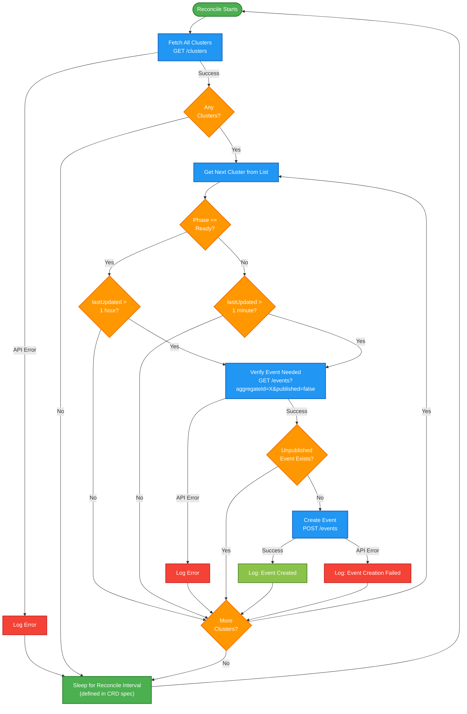

### Event Ticker Flow

**Purpose**: This diagram shows how the Event Ticker (Kubernetes operator) decides when to create reconciliation events for clusters.

**Pattern**: Continuous reconciliation loop triggered by CRD configuration



## Key Patterns

### CRD-Driven Configuration

**Operator Config (CRD)**:
```yaml
apiVersion: hyperfleet.io/v1
kind: EventTickerConfig
metadata:
  name: cluster-event-ticker
spec:
  reconcileInterval: 30s  # How often to reconcile
  objectType: cluster      # What to reconcile
```

**Benefits**:
- Configuration separate from code
- Can update reconcile interval without redeploying
- Standard Kubernetes operator pattern

---

### Two-Tier Time Windows

**Non-Ready Clusters**:
- Check every reconcile cycle (e.g., 30s)
- Create event if `lastUpdated > 1 minute`
- **Purpose**: Drive active processing, prevent spam

**Ready Clusters**:
- Check every reconcile cycle
- Create event if `lastUpdated > 1 hour`
- **Purpose**: Health monitoring, detect drift

---

### Continuous Reconciliation Loop

```
Reconcile → Fetch → Evaluate → Create Events → Sleep → Reconcile → ...
```

**Benefits**:
- Self-healing (retries failures automatically)
- Stateless (no memory of previous cycles)
- Simple error recovery (just skip and retry)

---

### Event Spam Prevention

**Three Layers**:
1. **Time-based**: Don't create if recently updated (1 min for pending, 1 hour for ready)
2. **Outbox check**: Don't create if unpublished event already exists
3. **Buffer window**: Adapters have time to process and update status before next event

**Result**: Efficient event creation without overwhelming the system

---

### MVP Simplicity

**MVP Characteristics**:
- Fetch all clusters (no filtering)
- Sequential processing (one at a time)
- Single operator instance
- Simple error handling (log and continue)

**Post-MVP Enhancements**:
- Sharding: Multiple operators handling different cluster subsets
- Parallel processing: Process multiple clusters concurrently
- State-based filtering: Only fetch clusters in specific phases
- Advanced backoff: Dynamic intervals based on cluster age/state