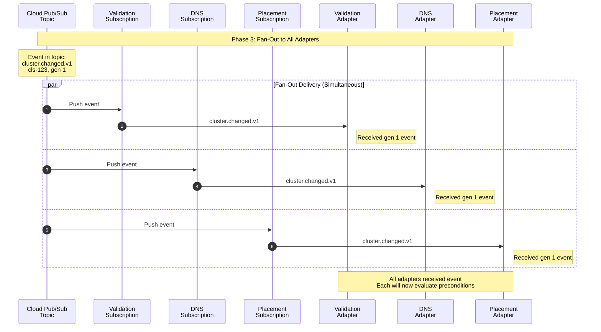

### Fan out to all adapters

#### Overview 
Cloud Pub/Sub receives the published event and **fans it out** to all adapter subscriptions simultaneously. Each adapter (Validation, DNS, Placement) receives a copy of the event independently. This is the **Pub/Sub fan-out pattern** in action.

