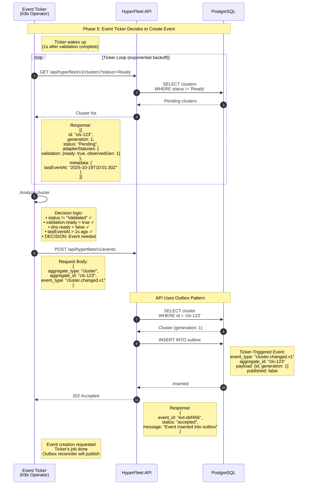

### Event Ticker Decides to Create Reconciliation Event

#### Overview
The **Event Ticker** (K8s operator), lists all clusters from the API, analyzes cluster state, decides a reconciliation event is needed, and calls `POST /api/hyperfleet/v1/events`. The API inserts the event into the outbox table. This is our **three separate concerns** : Ticker (decide) → API (store) → Outbox Reconciler (publish).

