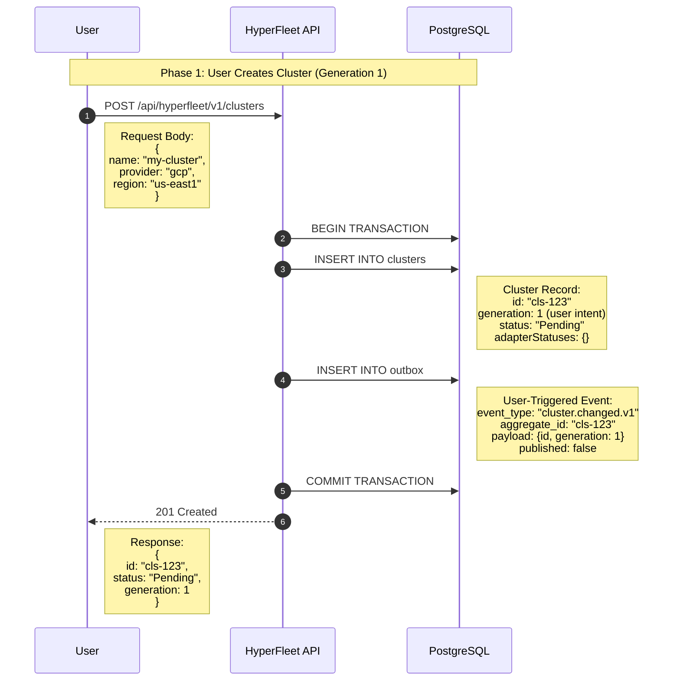

### Phase 1 : User create cluster

#### Overview 

The user initiates cluster creation by sending a POST request to the HyperFleet API. The API uses a database transaction to atomically create both the cluster record and an event in the outbox table. This is the first use of the outbox pattern in the workflow

