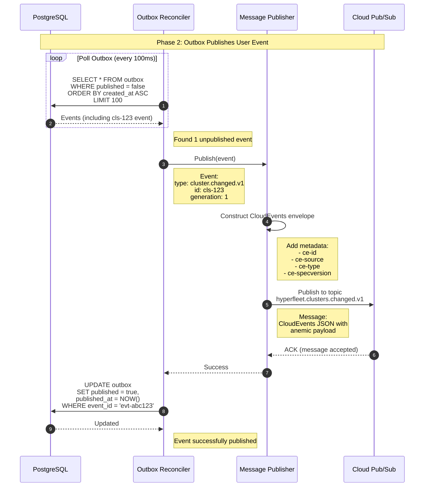

### Outbox Publishes Events

#### Overview

The Outbox Reconciler polls the database for unpublished events, finds the event created in phase 1, publishes it to the Pub/Sub via the Message Publisher, and marks it as published. This completes the outbox pattern, Note the outbox reconciler is always reconciling on the event table looking for unpublished events

