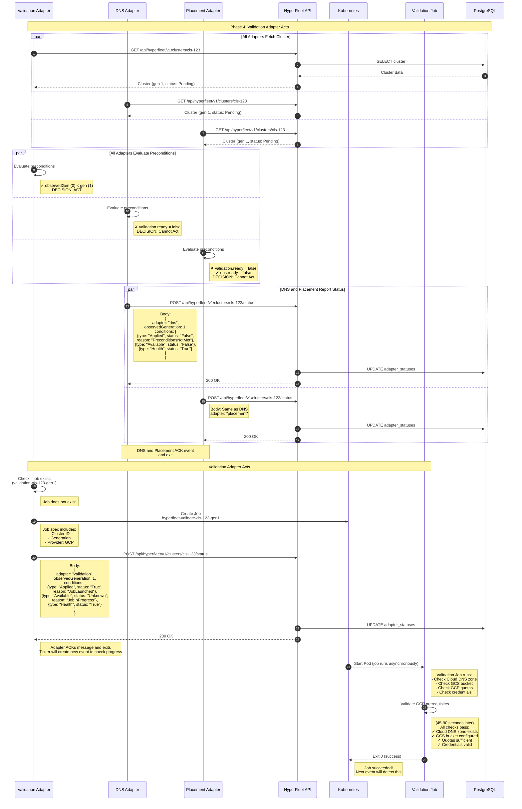

### Validation Adapater Acts

#### Overview

The Validation Adapter evaluates its preconditions, determines it should **ACT**, creates a Kubernetes Job to validate GCP prerequisites, and reports status back to the API. The other adapters (DNS, Placement) evaluate their preconditions and **IGNORE** the event because their dependencies aren't ready yet.

