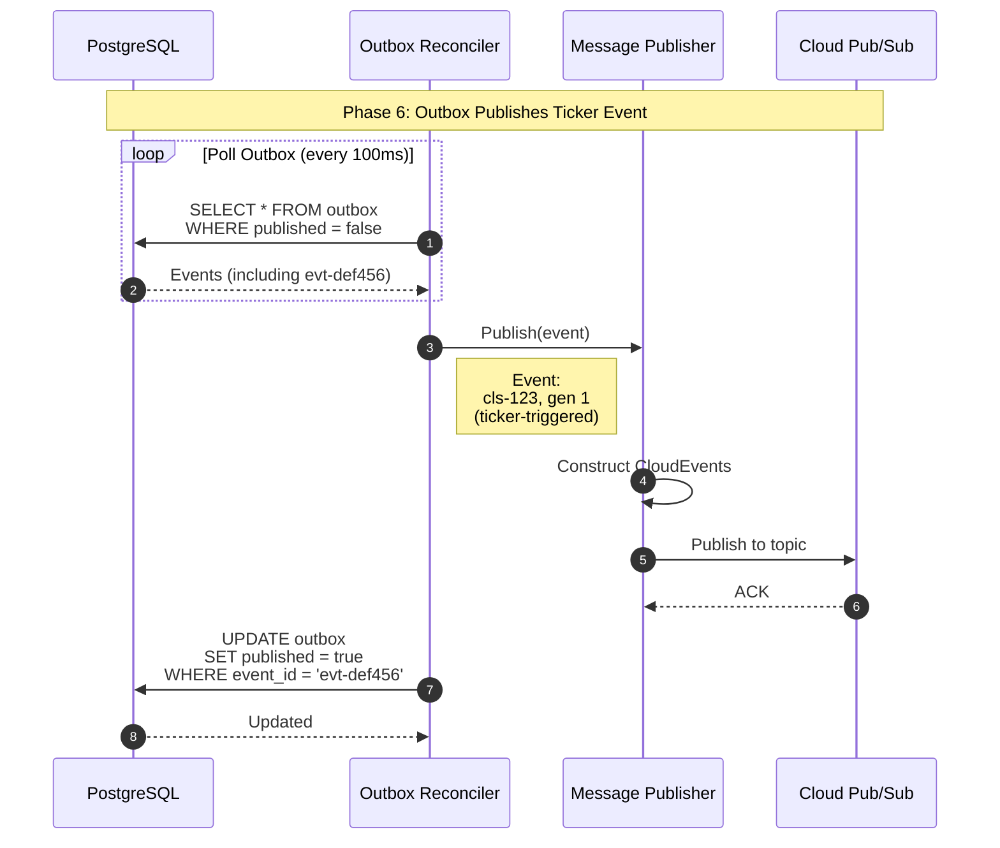

### Outbox Publishes Ticker Event

#### Overview

The Outbox Reconciler polls the database, finds the ticker-created event from Phase 5, publishes it to Cloud Pub/Sub, and marks it as published. This completes the second cycle of the outbox pattern.

This is the secret sauce, events are not driven by adapters themselves, they are drive my either : 
- 1 Create/Update on objects (If the intent of the object changes)
- 2 Time based decided by the ticker operator

