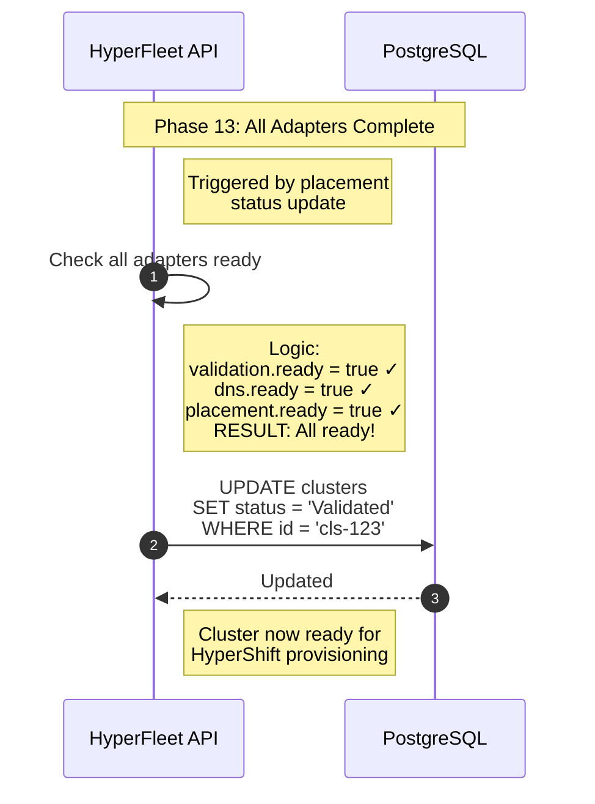

### All Adapaters Complete

#### Overview

The API detects that all required adapters have completed successfully and updates the cluster phase from `Pending` to `Ready` The cluster is now provisioned

The key point here is phase-05 will continue to tick and create new events for all cluster objects regradless of cluster phase. 

